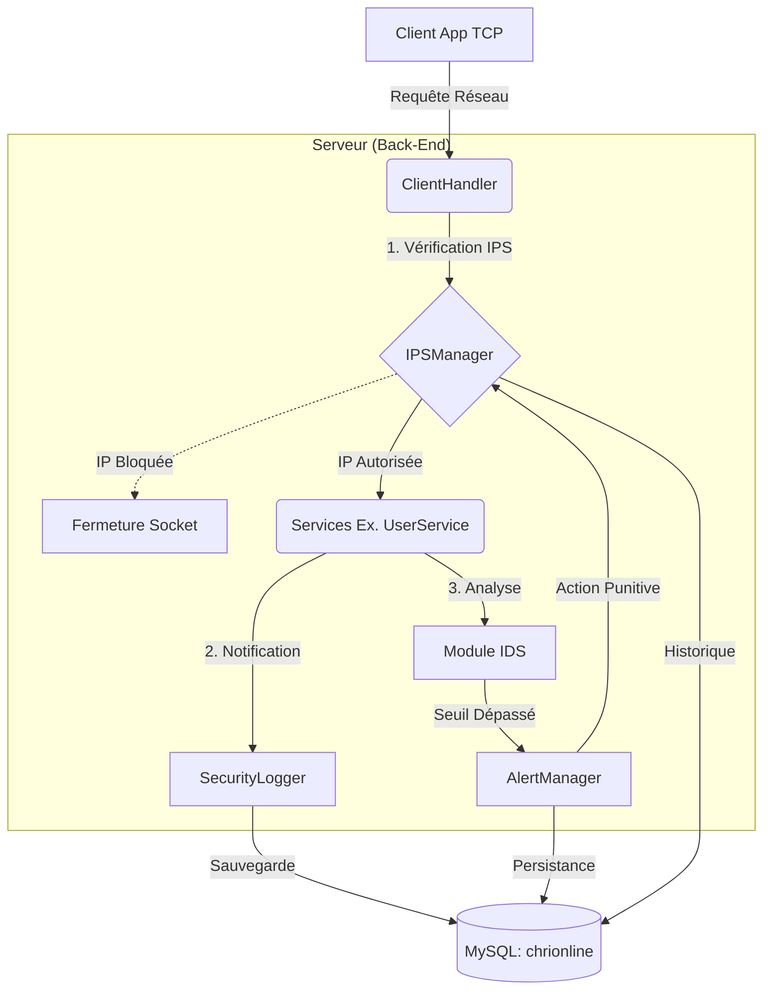
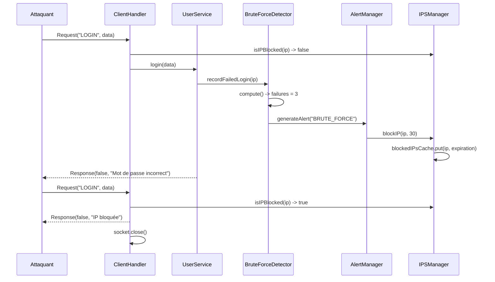

# Rapport d'Implémentation : Système de Détection et de Prévention d'Intrusion (IDS/IPS)

Ce rapport détaille la conception, l'architecture et l'implémentation concrète au sein du code source du module de sécurité **IDS/IPS** pour la plateforme E-Commerce ChriOnline. Il est conçu pour démontrer exactement où et comment les traitements de sécurité sont effectués dans le projet.

---

## 1. Vue d'Ensemble de l'Architecture

Le système de sécurité repose sur trois piliers majeurs qui interceptent, analysent, et bloquent les menaces de manière autonome et asynchrone pour ne pas ralentir l'application.

---

## 2. Localisation des Traitements dans le Code Source

Pour répondre aux exigences techniques, voici la cartographie exacte des composants de sécurité implémentés dans le code Java :

### 🛡️ A. Interception Réseau & IPS Actif
**Fichier cible :** `ma.ensate.server.network.ClientHandler`
- **Le Traitement :** C'est le pare-feu (Firewall) applicatif de notre système.
- **Dans le code :** 
  - Au tout début de la méthode `run()` et à l'intérieur de la boucle de requêtes `while(true)`, le code appelle `IPSManager.isIPBlocked(clientIP)`.
  - Si l'IP est bannie, le serveur refuse le traitement de la requête, renvoie un message d'erreur, et force `socket.close()` pour déconnecter l'attaquant instantanément (même en plein milieu d'une session).
  - *Exception :* Le code autorise l'administrateur à passer même si son IP est bloquée (grâce à la vérification `isAdmin(request.getToken())`), afin d'éviter qu'il ne se verrouille lui-même hors du système lors de ses tests locaux.

### 📝 B. Journalisation des Événements (SecurityLogger)
**Fichier cible :** `ma.ensate.server.security.logs.SecurityLogger`
- **Le Traitement :** Enregistre toutes les actions sensibles (tentatives de login, accès administrateur, etc.).
- **Dans le code :** La méthode `logEvent()` utilise un `ExecutorService` (Thread Pool) pour exécuter les requêtes `INSERT INTO security_logs` de manière **asynchrone**. Cela garantit que la sauvegarde des logs ne ralentit jamais la réponse renvoyée au client. Cette méthode est appelée massivement depuis `UserService.java`.

### 🕵️‍♂️ C. Les Détecteurs d'Intrusion (IDS)
L'IDS est divisé en plusieurs classes expertes dans le package `ma.ensate.server.security.ids` :

1. **`BruteForceDetector.java`**
   - **Déclencheur :** Appelé dans `UserService.login()` en cas de mauvais mot de passe.
   - **Logique :** Utilise un `ConcurrentHashMap` pour stocker les `timestamps` des échecs de connexion par IP. Si le tableau contient **3 échecs en moins d'une minute** (`TIME_WINDOW_MS = 60000`), il déclenche une alerte.
2. **`OtpAbuseDetector.java`**
   - **Déclencheur :** Appelé dans `UserService.verifyOtp()`.
   - **Logique :** Si un utilisateur entre **3 faux codes OTP consécutifs**, le détecteur génère une alerte de sévérité Haute (High).
3. **`RequestFloodDetector.java`**
   - **Déclencheur :** Appelé dans `ClientHandler.run()`.
   - **Logique :** Limite le rythme de requêtes à **50 par seconde**. Prévient contre les attaques de type DDoS TCP Applicatif.
4. **`AdminAnomalyDetector.java`**
   - **Déclencheur :** Appelé dans le `ClientHandler` lors du traitement de l'action `LISTER_UTILISATEURS`.
   - **Logique :** Détecte le comportement de *Scraping* ou d'exfiltration de données. Si l'action est répétée **plus de 5 fois par minute** (`MAX_SENSITIVE_ACCESS_PER_MINUTE`), une alerte critique est levée.

### 🚨 D. Gestionnaire d'Alertes et Punition
**Fichiers cibles :** `AlertManager.java` et `IPSManager.java`
- **Le Traitement :** Quand un des détecteurs trouve une anomalie, il appelle `AlertManager.generateAlert()`.
- **Dans le code :** 
  - `AlertManager` enregistre l'alerte en BDD asynchrone, puis appelle la méthode `triggerIPS()`.
  - `triggerIPS()` invoque `IPSManager.blockIP(targetIp, 30, ...)`.
  - `IPSManager` ajoute l'adresse IP de l'attaquant dans un **Cache en Mémoire (`ConcurrentHashMap`)** pour un blocage immédiat à durée déterminée (ex: 30 minutes), et sauvegarde l'état dans la BDD.

### 📊 E. Tableau de Bord (Dashboard Administrateur)
**Fichiers cibles :** `AdminSecurityView.java` & `admin_security.fxml` (Client) + `SecurityService.java` (Serveur)
- **Le Traitement :** Interface JavaFX complète pour visualiser l'état de sécurité et agir.
- **Dans le code :** La méthode `refreshAll()` de `AdminSecurityView` envoie les requêtes (`GET_SECURITY_LOGS`, `GET_IDS_ALERTS`, `GET_BLOCKED_IPS`) via `envoyerRequeteSecurisee` pour récupérer les objets métiers (`SecurityLog`, `SecurityAlert`, `BlockedIP`). Elle contient également l'action de déblocage manuel d'une IP (`unblockIP()`).

---

## 3. Diagramme de Séquence : Réaction face à une Attaque

Ce diagramme montre l'exécution des appels de méthodes dans le code lors d'une attaque par Brute Force.

---

## 4. Persistance (Base de Données)

Le script d'initialisation (`ids_ips_schema.sql`) implémente 3 tables optimisées :

1. **`security_logs`** : L'historique complet, qui trace l'`ip_address`, l'`action_type` (ex: LOGIN_FAILED), et le `status`.
2. **`security_alerts`** : Concentré des attaques réelles détectées par les IDS, avec un niveau de `severity` (LOW, MEDIUM, HIGH, CRITICAL).
3. **`blocked_ips`** : Table partagée avec l'IPS pour mémoriser la date d'expiration d'un bannissement (`blocked_until`), permettant au serveur de recharger les blocages même après un redémarrage (`IPSManager.loadBlockedIPsFromDB()`).

---

## Conclusion
L'implémentation choisie garantit une séparation des responsabilités (SOC). Les règles de détection (IDS) sont séparées des règles de punition (IPS), ce qui permet de configurer le système facilement (ex: abaisser les seuils) et d'assurer des performances maximales grâce à l'utilisation intensive des `ConcurrentHashMap` et de l'asynchronisme côté serveur.
