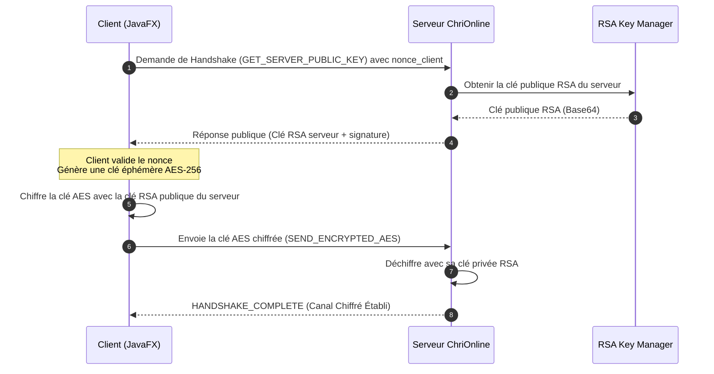
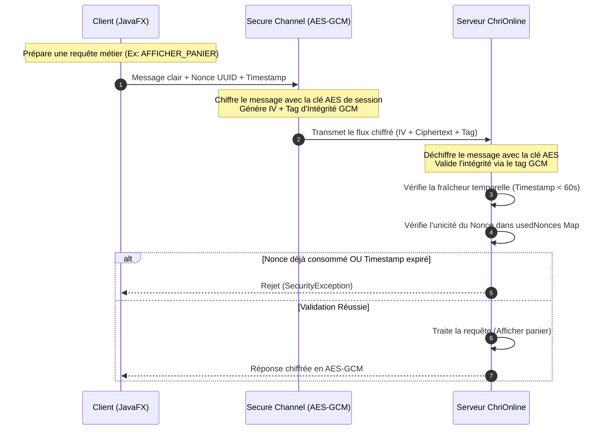
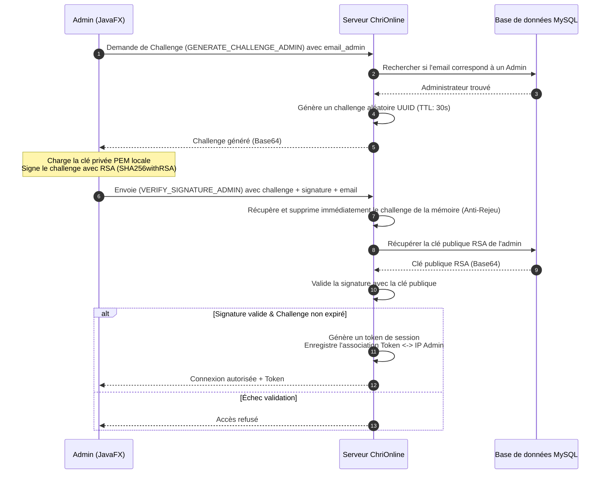
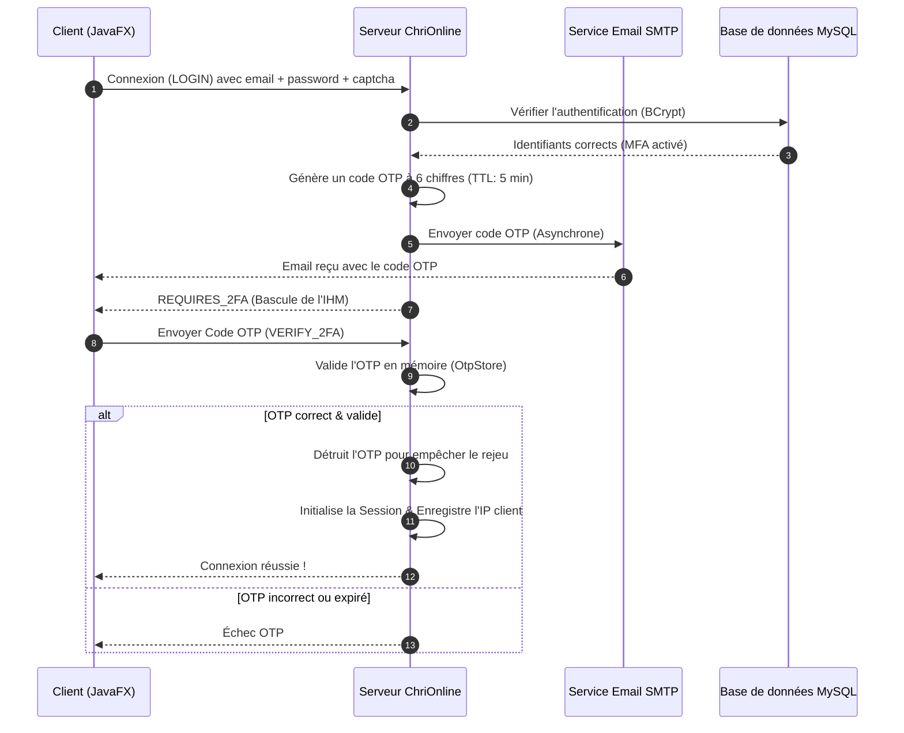
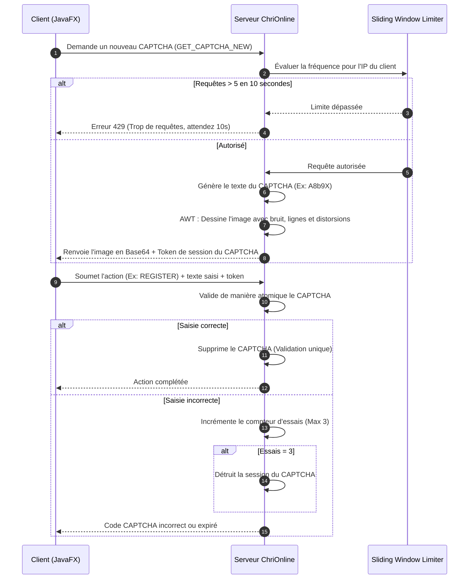
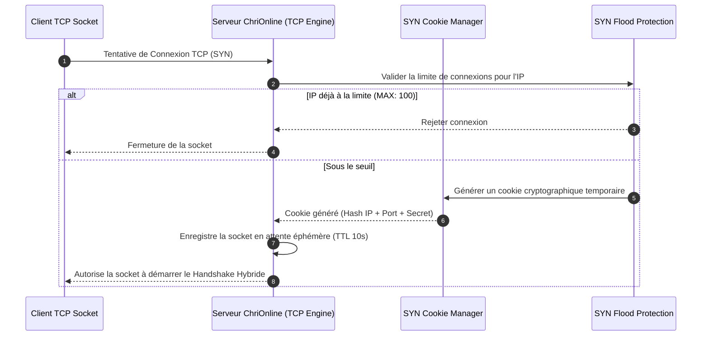
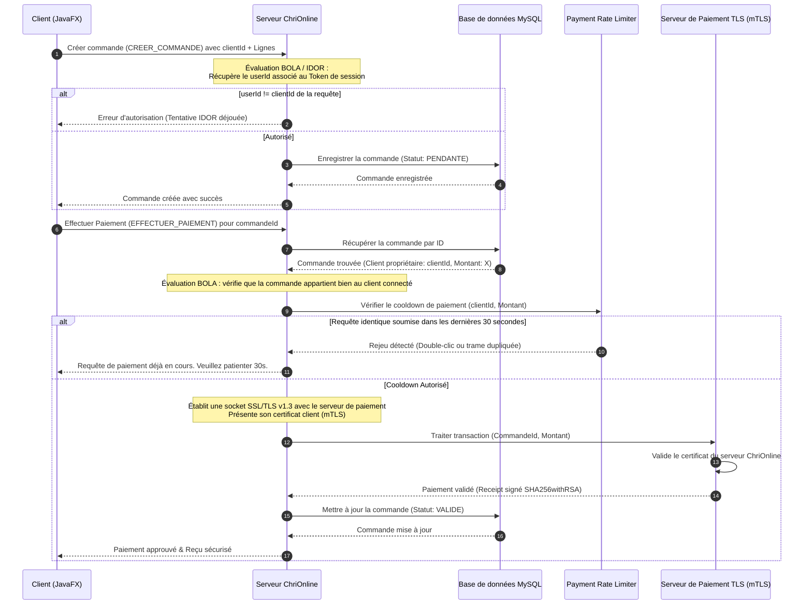

# DOCUMENTATION D'ARCHITECTURE & FLUX DE SÉCURITÉ
## Projet ChriOnline — Cartographie et Flux de Sécurité

> [!NOTE]
> Cette documentation présente l'architecture de sécurité multi-couches de l'application **ChriOnline** et détaille graphiquement les protocoles d'échange réseau sous forme de diagrammes de séquence Mermaid.

---

## 1. Vue d'Ensemble de l'Architecture

ChriOnline adopte une architecture client/serveur robuste reposant sur des **Sockets TCP persistantes**, des **Sockets SSL/TLS mutuellement authentifiées**, et une base de données **MySQL** pour la persistance des données. 

La sécurité du système est structurée selon le modèle de la **Défense en Profondeur**, répartie sur 6 couches logiques distinctes pour garantir qu'aucune vulnérabilité isolée ne puisse compromettre l'intégralité du système.

---

## 2. Matrice de Sécurité Multi-Couches

| Couche Logique | Menaces Atténuées | Mécanismes & Algorithmes | Classes Clés Responsables |
| :--- | :--- | :--- | :--- |
| **1. Réseau & Pare-feu** | SYN Flood, Déni de Service (DoS), Spoofing d'IP | Limiteur de connexions par IP, nettoyage des sockets éphémères pendantes, cookies cryptographiques. | [SYNFloodProtection.java](file:///c:/GI2-2/S%C3%A9curit%C3%A9%20Informatique/ChriOnline/src/main/java/ma/ensate/server/security/SYNFloodProtection.java) [SYNCookieManager.java](file:///c:/GI2-2/S%C3%A9curit%C3%A9%20Informatique/ChriOnline/src/main/java/ma/ensate/server/security/SYNCookieManager.java) |
| **2. Transport & Tunnel** | Interception (MITM), Eavesdropping sur transactions bancaires | SSL/TLS v1.3 strict, Authentification mutuelle client-serveur (mTLS) par certificats. | [TLSPaymentServer.java](file:///c:/GI2-2/S%C3%A9curit%C3%A9%20Informatique/ChriOnline/src/main/java/ma/ensate/server/network/TLSPaymentServer.java) |
| **3. Session & Confidentialité** | Usurpation de session (Hijacking), Rejeu de paquets réseau | Handshake hybride RSA-2048 / AES-256, chiffrement symétrique AES-GCM-128, nonces d'unicité (UUID), timestamps de fraîcheur. | [SecureHandshake.java](file:///c:/GI2-2/S%C3%A9curit%C3%A9%20Informatique/ChriOnline/src/main/java/ma/ensate/security/SecureHandshake.java) [SecureChannel.java](file:///c:/GI2-2/S%C3%A9curit%C3%A9%20Informatique/ChriOnline/src/main/java/ma/ensate/security/SecureChannel.java) |
| **4. Authentification & MFA** | Force brute, Usurpation d'identités, Scripts automatiques (Spambots) | Double authentification (MFA) via OTP par email, challenge-response asymétrique RSA (clés PEM), protection anti-brute force à verrouillage incrémental, CAPTCHA AWT distordu avec Sliding-Window Rate Limiting. | [AdminAuthService.java](file:///c:/GI2-2/S%C3%A9curit%C3%A9%20Informatique/ChriOnline/src/main/java/ma/ensate/security/AdminAuthService.java) [OtpStore.java](file:///c:/GI2-2/S%C3%A9curit%C3%A9%20Informatique/ChriOnline/src/main/java/ma/ensate/server/services/OtpStore.java) [CaptchaService.java](file:///c:/GI2-2/S%C3%A9curit%C3%A9%20Informatique/ChriOnline/src/main/java/ma/ensate/server/services/CaptchaService.java) [UtilisateurDAO.java](file:///c:/GI2-2/S%C3%A9curit%C3%A9%20Informatique/ChriOnline/src/main/java/ma/ensate/server/dao/UtilisateurDAO.java) |
| **5. Autorisation & Métier** | BOLA/IDOR (Broken Object Level Authorization), Double-clic de paiement accidentel | Liaison IP-Session, contrôle d'IP admin (réseau interne), validation systématique de la correspondance Token <-> ID Cible, limiteur de double-paiement (cooldown 30s). | [ClientHandler.java](file:///c:/GI2-2/S%C3%A9curit%C3%A9%20Informatique/ChriOnline/src/main/java/ma/ensate/server/network/ClientHandler.java) [SessionManager.java](file:///c:/GI2-2/S%C3%A9curit%C3%A9%20Informatique/ChriOnline/src/main/java/ma/ensate/server/services/SessionManager.java) [PaymentRateLimiter.java](file:///c:/GI2-2/S%C3%A9curit%C3%A9%20Informatique/ChriOnline/src/main/java/ma/ensate/server/services/PaymentRateLimiter.java) |
| **6. Données & Intégrité** | Fuite physique de base de données, Injection SQL, Non-répudiation | Requêtes JDBC paramétrées `PreparedStatement`, hachage BCrypt (coût 12) avec migration active transparente, signatures de reçus de transactions SHA256withRSA via KeyStore Java (PKCS12), chiffrement AES-GCM At-Rest. | [KeyStoreManager.java](file:///c:/GI2-2/S%C3%A9curit%C3%A9%20Informatique/ChriOnline/src/main/java/ma/ensate/security/KeyStoreManager.java) [DigitalSignatureService.java](file:///c:/GI2-2/S%C3%A9curit%C3%A9%20Informatique/ChriOnline/src/main/java/ma/ensate/security/DigitalSignatureService.java) [UtilisateurDAO.java](file:///c:/GI2-2/S%C3%A9curit%C3%A9%20Informatique/ChriOnline/src/main/java/ma/ensate/server/dao/UtilisateurDAO.java) |

---

## 3. Flux et Protocoles de Sécurité (Mermaid Sequence Diagrams)

### Diagramme 1 : Protocole du Handshake Hybride (RSA + AES)
Ce flux détaille l'initialisation éphémère du canal de communication chiffré à chaque nouvelle socket.

---

### Diagramme 2 : Transmission sur Canal Sécurisé & Protection Anti-Rejeu
Ce flux illustre comment chaque requête métier est chiffrée et protégée contre les interceptions et les attaques par rejeu.

---

### Diagramme 3 : Authentification Passwordless des Administrateurs
Ce protocole montre comment un administrateur s'authentifie à l'aide de sa clé privée locale sans jamais transmettre de mot de passe sur le réseau.

---

### Diagramme 4 : Double Authentification (MFA/2FA par OTP Email)
Ce flux décrit le second facteur d'authentification requis pour les comptes clients.

---

### Diagramme 5 : Protection Anti-Bot & Rate Limiting CAPTCHA
Ce schéma illustre la double protection CAPTCHA visuelle et le rate-limiting réseau glissant empêchant les attaques par déni de service.

---

### Diagramme 6 : Validation Réseau (SYN Cookies & Flood Protection)
Ce flux présente comment le serveur valide la socket avant d'allouer des ressources thread complexes.

---

## 4. Flux Applicatifs standards avec Contrôles de Sécurité

### Diagramme 7 : Création de Commande & Paiement (BOLA + Cooldown mTLS)
Ce flux intègre la validation d'autorisation métier (BOLA/IDOR) et la liaison avec la passerelle bancaire TLS.

