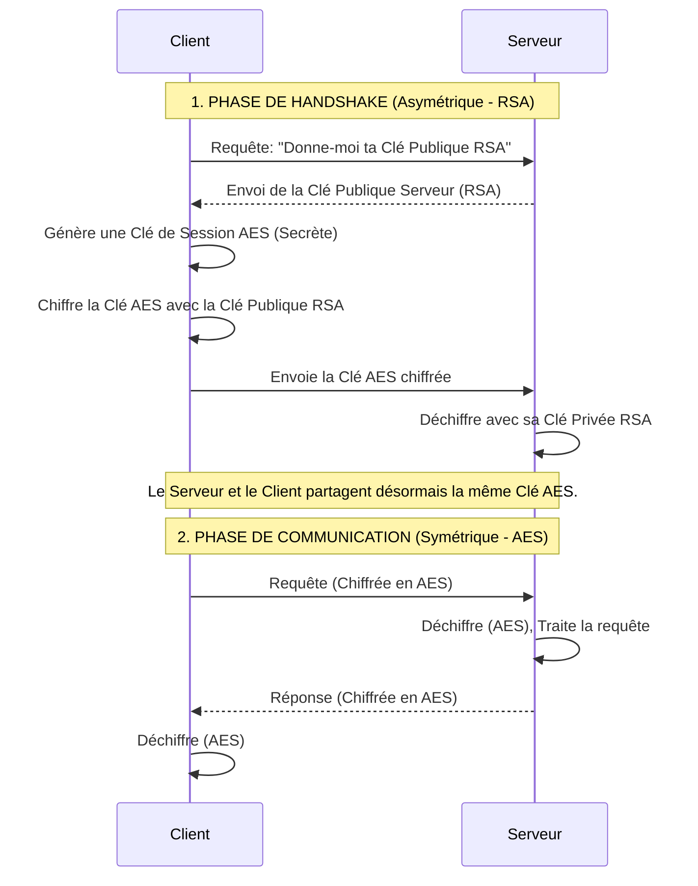
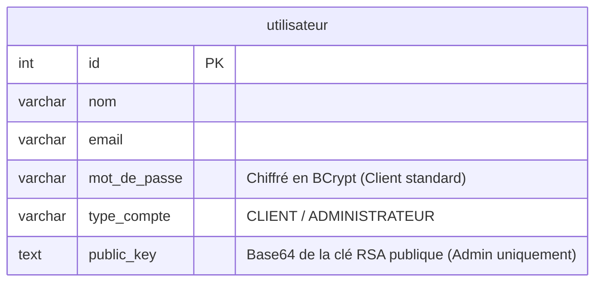

# Rapport d'Implémentation : Architecture Cryptographique (RSA & AES)

Ce rapport détaille la conception et l'implémentation du système de cryptographie hybride (RSA + AES) et des mécanismes de signature numérique au sein du projet E-Commerce ChriOnline. Il illustre la façon dont l'intégrité, la confidentialité et l'authentification forte sont garanties au niveau du code.

---

## 1. Vue d'Ensemble de l'Architecture (Chiffrement Hybride)

L'application n'envoie **jamais de données en clair** sur le réseau TCP. Elle utilise une architecture de chiffrement hybride, combinant la robustesse du chiffrement asymétrique (RSA) pour l'échange initial des clés, et la rapidité du chiffrement symétrique (AES) pour le transfert des données.

---

## 2. Localisation des Traitements dans le Code Source

Voici la cartographie exacte des implémentations cryptographiques dans le projet Java :

### 🤝 A. Le Protocole d'Échange de Clé (Secure Handshake)
**Fichiers cibles :** `ma.ensate.security.SecureHandshake` et `ma.ensate.client.network.ClientTCP`
- **Le Traitement :** Échange sécurisé de la clé de session au tout début de la connexion.
- **Dans le code :**
  - Côté Serveur, dès qu'un `Socket` est accepté dans `ClientHandler.run()`, le serveur lance une méthode d'attente du handshake.
  - Côté Client, lors de l'appel à `ClientTCP.connecter()`, le client exécute `SecureHandshake.performClientHandshake()`.
  - Le code utilise `Cipher.getInstance("RSA/ECB/PKCS1Padding")` pour encapsuler mathématiquement la clé AES générée. 

### 🔒 B. Le Canal Sécurisé de Données (SecureChannel)
**Fichier cible :** `ma.ensate.security.SecureChannel`
- **Le Traitement :** Wrapper autour des flux TCP (`InputStream`/`OutputStream`) qui chiffre/déchiffre les objets Java de manière transparente.
- **Dans le code :**
  - La méthode `writeSecureRequest(Request req)` transforme l'objet en tableau d'octets (`ByteArrayOutputStream`), puis appelle `Cipher.getInstance("AES/CBC/PKCS5Padding")` pour chiffrer les octets avant de les envoyer.
  - La méthode `readSecureRequest()` lit les octets chiffrés, les déchiffre avec la même clé AES de session, puis effectue une désérialisation (`ObjectInputStream`) pour reconstruire l'objet métier.

### ✍️ C. Authentification Administrateur (Signatures Numériques)
**Fichiers cibles :** `ma.ensate.client.views.AdminLoginView` (Client) et `ma.ensate.server.services.UserService` (Serveur)
- **Le Traitement :** Authentification forte à deux facteurs sans mot de passe, basée sur une preuve de possession (Clé Privée).
- **Dans le code (Flux) :**
  1. **Demande :** Le client envoie l'email. L'action `GENERATE_CHALLENGE_ADMIN` dans `UserService` génère un mot aléatoire (`UUID.randomUUID()`) et le renvoie.
  2. **Signature (Client) :** Dans `AdminLoginView.java`, le code charge la clé privée de l'admin depuis un fichier local (`.pem` ou `.der`), initialise le moteur de signature avec `Signature.getInstance("SHA256withRSA")`, signe les octets du challenge, et renvoie la signature encodée en Base64.
  3. **Vérification (Serveur) :** Le serveur récupère la clé publique de cet administrateur depuis la BDD via `UtilisateurDAO.getPublicKeyByEmail()`. Il l'injecte dans le moteur `Signature.verify()` pour s'assurer que la signature correspond parfaitement au challenge.

### 🛠️ D. Les Utilitaires Cryptographiques
**Fichier cible :** `ma.ensate.security.CryptoUtil`
- **Le Traitement :** Boîte à outils contenant les primitives cryptographiques.
- **Dans le code :** Ce fichier concentre les générateurs (`KeyGenerator.getInstance("AES")`, `KeyPairGenerator.getInstance("RSA")`), ainsi que le traitement des algorithmes de hachage comme BCrypt ou SHA-256 pour les mots de passe des utilisateurs standards.

---

## 3. Schéma de Stockage des Clés (Base de Données)

Pour que la vérification des signatures (RSA) fonctionne, l'infrastructure de la base de données MySQL doit héberger les clés publiques.

**Concept Clé :** Le champ `mot_de_passe` n'est pas utilisé par l'administrateur. La sécurité repose intégralement sur le champ `public_key`. À l'inverse, le fichier de clé privée (`private_key.pem`) ne quitte jamais l'ordinateur physique de l'administrateur, rendant l'usurpation d'identité réseau impossible.

---

## 4. Bilan Sécuritaire (Confidentialité et Intégrité)

1. **Confidentialité (AES) :** Les numéros de carte de crédit, les identifiants, et l'historique des commandes sont totalement opaques pour un attaquant sur le même réseau (Man-in-the-Middle).
2. **Authenticité (RSA) :** Le client est certain de parler au vrai serveur car seul ce dernier possède la clé privée capable de décoder la clé de session AES durant le handshake.
3. **Non-Répudiation (Signatures) :** Une action validée par la signature RSA de l'administrateur prouve mathématiquement et légalement que c'est bien l'administrateur qui en est à l'origine.
