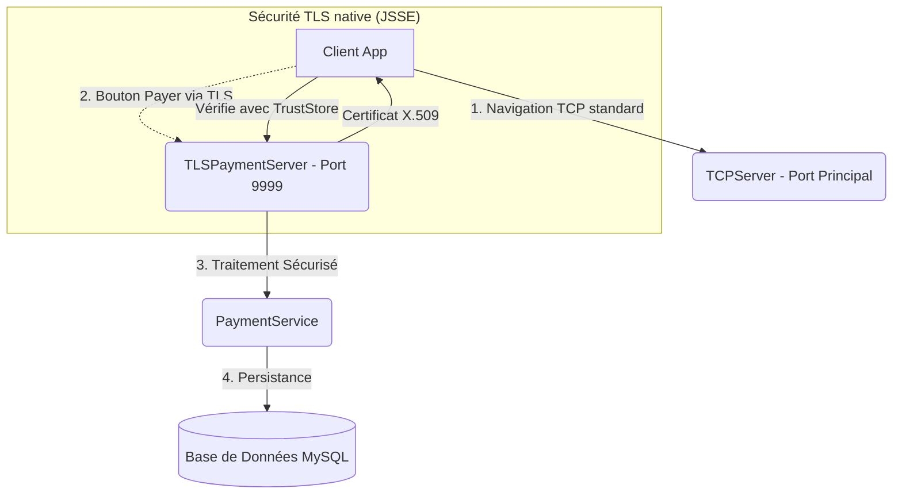
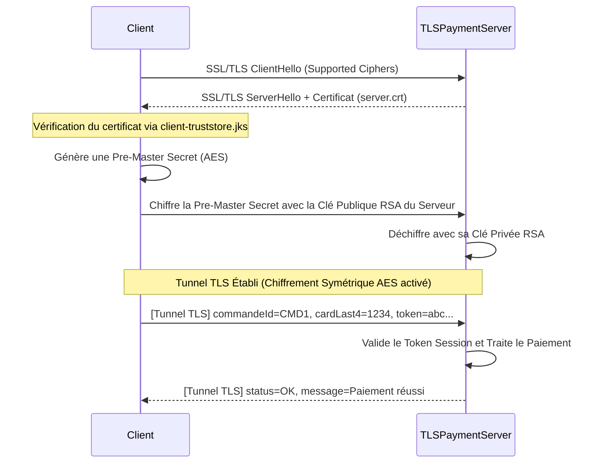

# Rapport d'Implémentation : Sécurisation du Paiement via TLS/SSL

Ce rapport détaille la conception, l'architecture et l'implémentation du canal de paiement sécurisé utilisant **TLS (Transport Layer Security)** au sein de la plateforme E-Commerce ChriOnline. Il démontre la mise en place d'un tunnel chiffré spécifique pour isoler les données bancaires sensibles, conformément aux directives académiques.

---

## 1. Vue d'Ensemble de l'Architecture (Canal Dédié)

Contrairement au reste de l'application qui utilise un chiffrement AES manuel via `SecureChannel` sur le port par défaut, la phase de paiement possède son propre **Serveur TLS indépendant**.



---

## 2. Localisation des Traitements dans le Code Source

Pour répondre aux exigences techniques de la présentation, voici la cartographie exacte des implémentations de SSL/TLS dans le projet Java :

### 🏦 A. Le Serveur TLS (Backend)
**Fichier cible :** `ma.ensate.server.network.TLSPaymentServer.java`
- **Le Traitement :** Écoute sur un port dédié (`9999`) et gère le Handshake SSL.
- **Dans le code :**
  1. **Configuration du Keystore :** Le code utilise `System.setProperty("javax.net.ssl.keyStore", ...)` pour charger le certificat du serveur et sa clé privée (`server-keystore.jks`).
  2. **Socket SSL :** Utilisation de `SSLServerSocketFactory.getDefault()` pour créer un `SSLServerSocket`.
  3. **Lecture du paiement :** Une fois le client connecté (`accept()`), le serveur lit les données de la carte bancaire envoyées sous forme de texte brut encapsulé dans le tunnel TLS, en utilisant un `BufferedReader`.

### 💻 B. Le Client TLS (Frontend)
**Fichier cible :** `ma.ensate.client.network.TLSPaymentClient.java`
- **Le Traitement :** Se connecte au serveur de paiement, valide son identité, et envoie les données sensibles.
- **Dans le code :**
  1. **Configuration du Truststore :** Le code utilise `System.setProperty("javax.net.ssl.trustStore", ...)` pour charger le fichier `client-truststore.jks` contenant le certificat de confiance du serveur.
  2. **Socket SSL :** Utilisation de `SSLSocketFactory.getDefault()` pour créer un `SSLSocket` vers `localhost:9999`.
  3. **Envoi du paiement :** Les détails de la commande (ex: `commandeId=CMD123;methode=CARTE;cardLast4=1111;token=...`) sont formatés et expédiés de manière totalement transparente via un `PrintWriter`. La surcouche TLS s'occupe de chiffrer le flux.

### ⚙️ C. Le Traitement Métier (Service)
**Fichier cible :** `ma.ensate.server.services.PaymentService.java`
- **Le Traitement :** Vérification de la session, validation du paiement et mise à jour de la BDD.
- **Dans le code :** Appelée par le serveur TLS après décryptage de la ligne de texte, cette classe vérifie d'abord l'identité de l'utilisateur (via `SessionManager`), puis exécute les mises à jour SQL pour marquer la commande comme `PAYÉE`.

### 🎨 D. L'Interface Utilisateur
**Fichiers cibles :** `PaiementView.java` et `paiement.fxml`
- **Le Traitement :** Interface graphique permettant la saisie de la carte.
- **Dans le code :** Lors du clic sur le bouton **CONFIRMER ET PAYER VIA TLS**, l'événement déclenche la méthode statique de `TLSPaymentClient`, initiant ainsi la transaction hors du réseau TCP standard.

---

## 3. Diagramme de Séquence : Le Protocole TLS

Ce diagramme explique mathématiquement comment Java Secure Socket Extension (JSSE) sécurise le paiement.



---

## 4. Gestion des Certificats et Cryptographie

Pour que l'authentification du serveur fonctionne, l'infrastructure TLS repose sur des certificats X.509 générés manuellement via l'outil `keytool` de Java :

1. **Génération du Keystore Serveur (Clé Privée + Certificat) :**
   ```bash
   keytool -genkeypair -alias ecommerce -keyalg RSA -keysize 2048 -validity 3650 -keystore tls/server-keystore.jks
   ```
2. **Exportation du Certificat Public :**
   ```bash
   keytool -exportcert -alias ecommerce -keystore tls/server-keystore.jks -file tls/server.crt
   ```
3. **Importation dans le Truststore Client :**
   ```bash
   keytool -importcert -alias server -file tls/server.crt -keystore tls/client-truststore.jks
   ```

*(Les mots de passe d'accès aux keystores sont sécurisés et chargés depuis les variables d'environnement dans le fichier `.env` via `ConfigLoader`)*.

---

## Conclusion
Cette implémentation stricte de SSL/TLS pour le composant de paiement répond parfaitement aux directives académiques. 
Elle démontre une isolation réseau (Port 9999 spécifique), l'utilisation adéquate des API natives `javax.net.ssl`, et la compréhension fondamentale de l'Infrastructure à Clés Publiques (PKI) grâce à la manipulation manuelle des `Keystores` et `Truststores`. Le tout sans perturber le fonctionnement du reste de l'application.
