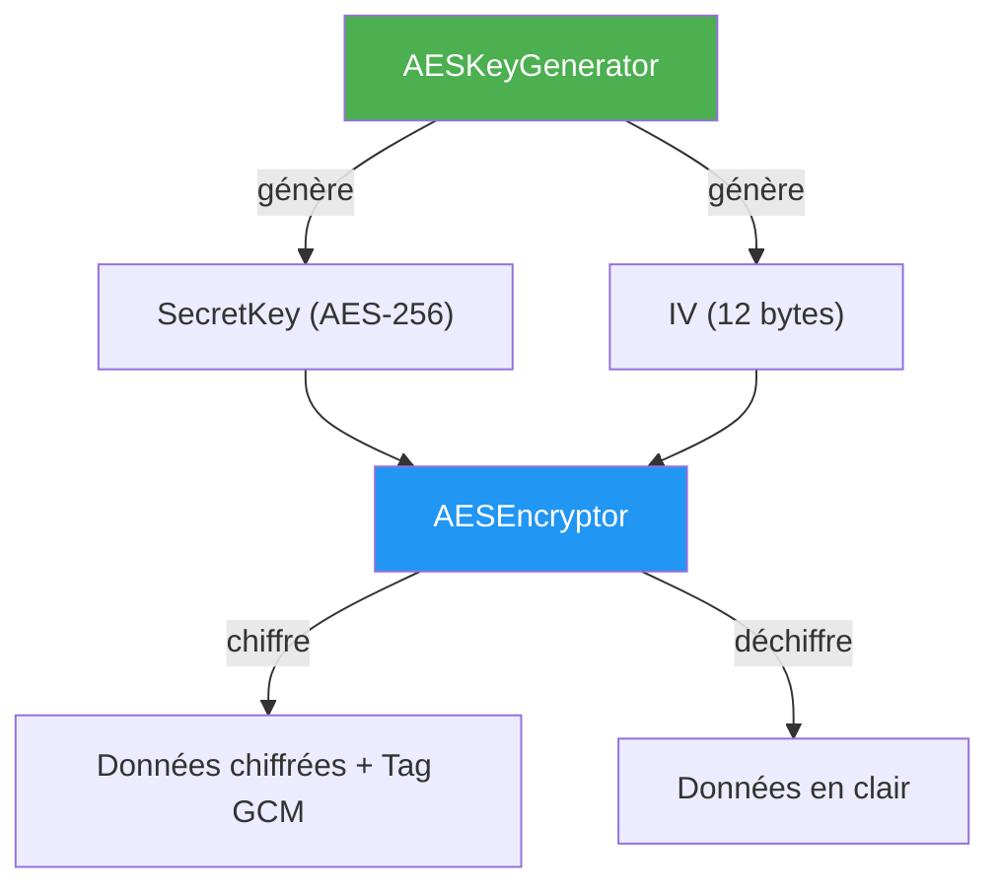
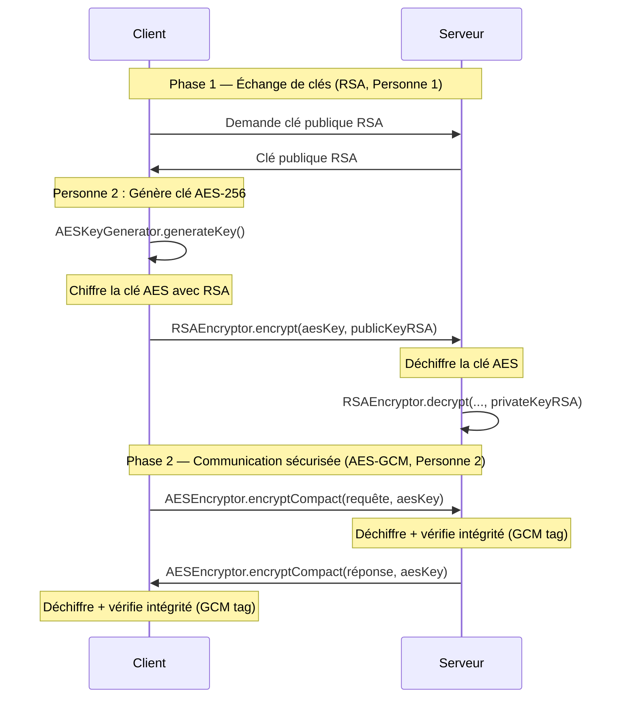

# Personne 2 : Implémentation AES & Chiffrement des Données

## Vue d'ensemble

Ce document détaille l'implémentation complète du chiffrement symétrique AES pour le projet ChriOnline. L'objectif est de fournir les composants nécessaires pour sécuriser les communications client-serveur dans le cadre d'un protocole inspiré de HTTPS.

> [!IMPORTANT]
> **Mode choisi : AES-GCM** (Galois/Counter Mode) au lieu de CBC.
> GCM fournit à la fois la **confidentialité** et l'**authentification** des données (AEAD), ce qui protège contre les attaques de type *padding oracle* et garantit l'intégrité.

---

## Architecture



---

## 1. AESKeyGenerator — Génération de clés et d'IV

**Fichier :** [AESKeyGenerator.java](file:///c:/ENSA/Génie%20Informatique/GI%202/S8/Sécurité%20Informatique/projets/src/main/java/ma/ensate/security/AESKeyGenerator.java)

### 1.1 Génération de clé AES-256

La clé est générée avec `KeyGenerator` et `SecureRandom` (source d'aléa cryptographiquement sûre) :

```java
private static final String ALGORITHM = "AES";
private static final int KEY_SIZE = 256;
private static final SecureRandom SECURE_RANDOM = new SecureRandom();

public static SecretKey generateKey() throws NoSuchAlgorithmException {
    KeyGenerator keyGenerator = KeyGenerator.getInstance(ALGORITHM);
    keyGenerator.init(KEY_SIZE, SECURE_RANDOM);
    return keyGenerator.generateKey();
}
```

> [!NOTE]
> `SecureRandom` utilise l'entropie du système d'exploitation pour générer des nombres aléatoires imprévisibles. Contrairement à `Random`, il est adapté à la cryptographie.

On peut aussi générer des clés de taille personnalisée (128, 192, 256 bits) :

```java
public static SecretKey generateKey(int keySize) throws NoSuchAlgorithmException {
    if (keySize != 128 && keySize != 192 && keySize != 256) {
        throw new IllegalArgumentException(
            "Taille de clé AES invalide : " + keySize + ". Valeurs acceptées : 128, 192, 256.");
    }
    KeyGenerator keyGenerator = KeyGenerator.getInstance(ALGORITHM);
    keyGenerator.init(keySize, SECURE_RANDOM);
    return keyGenerator.generateKey();
}
```

### 1.2 Génération d'IV (Initialization Vector)

L'IV est un vecteur d'initialisation **unique** pour chaque opération de chiffrement. Le NIST recommande **96 bits (12 bytes)** pour GCM :

```java
private static final int GCM_IV_LENGTH = 12; // 96 bits

public static byte[] generateIV() {
    byte[] iv = new byte[GCM_IV_LENGTH];
    SECURE_RANDOM.nextBytes(iv);
    return iv;
}
```

> [!WARNING]
> **Ne JAMAIS réutiliser un IV avec la même clé !** La réutilisation d'un IV en mode GCM compromet totalement la sécurité du chiffrement (permet de retrouver la clé d'authentification).

### 1.3 Sérialisation / Désérialisation

Pour transmettre la clé AES (chiffrée par RSA) ou la stocker, on la sérialise en Base64 :

```java
public static String serializeKey(SecretKey key) {
    return Base64.getEncoder().encodeToString(key.getEncoded());
}

public static SecretKey deserializeKey(String base64Key) {
    byte[] decodedKey = Base64.getDecoder().decode(base64Key);
    return new SecretKeySpec(decodedKey, 0, decodedKey.length, ALGORITHM);
}
```

De même pour l'IV :

```java
public static String encodeIV(byte[] iv) {
    return Base64.getEncoder().encodeToString(iv);
}

public static byte[] decodeIV(String base64IV) {
    return Base64.getDecoder().decode(base64IV);
}
```

---

## 2. AESEncryptor — Chiffrement / Déchiffrement

**Fichier :** [AESEncryptor.java](file:///c:/ENSA/Génie%20Informatique/GI%202/S8/Sécurité%20Informatique/projets/src/main/java/ma/ensate/security/AESEncryptor.java)

### 2.1 Chiffrement AES-GCM avec IV explicite

Les méthodes de base prennent les données, la clé et l'IV en paramètres :

```java
private static final String TRANSFORMATION = "AES/GCM/NoPadding";
private static final int GCM_TAG_LENGTH = 128; // Tag d'authentification de 128 bits

public static byte[] encrypt(byte[] data, SecretKey key, byte[] iv) throws Exception {
    validateParameters(data, key, iv);
    Cipher cipher = Cipher.getInstance(TRANSFORMATION);
    GCMParameterSpec gcmSpec = new GCMParameterSpec(GCM_TAG_LENGTH, iv);
    cipher.init(Cipher.ENCRYPT_MODE, key, gcmSpec);
    return cipher.doFinal(data);
}

public static byte[] decrypt(byte[] encryptedData, SecretKey key, byte[] iv) throws Exception {
    validateParameters(encryptedData, key, iv);
    Cipher cipher = Cipher.getInstance(TRANSFORMATION);
    GCMParameterSpec gcmSpec = new GCMParameterSpec(GCM_TAG_LENGTH, iv);
    cipher.init(Cipher.DECRYPT_MODE, key, gcmSpec);
    return cipher.doFinal(encryptedData);
}
```

> [!NOTE]
> **`AES/GCM/NoPadding`** : GCM est un mode de chiffrement par flux (stream cipher mode), donc aucun padding n'est nécessaire contrairement à CBC. Le tag de 128 bits à la fin des données chiffrées sert de vérification d'intégrité.

### 2.2 Variantes Base64 et String

Pour simplifier l'utilisation avec des Strings :

```java
public static String encryptString(String plainText, SecretKey key, byte[] iv) throws Exception {
    return encryptToBase64(plainText.getBytes(StandardCharsets.UTF_8), key, iv);
}

public static String decryptString(String encryptedBase64, SecretKey key, byte[] iv) throws Exception {
    byte[] decrypted = decryptFromBase64(encryptedBase64, key, iv);
    return new String(decrypted, StandardCharsets.UTF_8);
}
```

### 2.3 Mode Compact (IV préfixé) — Le plus pratique

C'est le mode **recommandé** pour l'intégration avec le `SecureChannel` (Personne 3). L'IV est automatiquement généré et préfixé aux données chiffrées :

```
Format de sortie : [IV (12 bytes)] || [Données chiffrées + Tag GCM (16 bytes)]
```

```java
public static String encryptCompact(String plainText, SecretKey key) throws Exception {
    byte[] iv = AESKeyGenerator.generateIV();
    byte[] encrypted = encrypt(
            plainText.getBytes(StandardCharsets.UTF_8), key, iv);

    // Préfixer l'IV aux données chiffrées
    ByteBuffer buffer = ByteBuffer.allocate(iv.length + encrypted.length);
    buffer.put(iv);
    buffer.put(encrypted);

    return Base64.getEncoder().encodeToString(buffer.array());
}

public static String decryptCompact(String compactBase64, SecretKey key) throws Exception {
    byte[] decoded = Base64.getDecoder().decode(compactBase64);

    if (decoded.length < GCM_IV_LENGTH) {
        throw new IllegalArgumentException("Données chiffrées trop courtes.");
    }

    ByteBuffer buffer = ByteBuffer.wrap(decoded);

    // Extraire l'IV (12 premiers bytes)
    byte[] iv = new byte[GCM_IV_LENGTH];
    buffer.get(iv);

    // Extraire les données chiffrées (le reste)
    byte[] encrypted = new byte[buffer.remaining()];
    buffer.get(encrypted);

    byte[] decrypted = decrypt(encrypted, key, iv);
    return new String(decrypted, StandardCharsets.UTF_8);
}
```

> [!TIP]
> **Avantage du mode compact** : le développeur n'a pas besoin de gérer l'IV séparément. C'est idéal pour Personne 3 qui intégrera cela dans `SecureChannel` :
> ```java
> // Chiffrer — un seul appel, l'IV est géré automatiquement
> String chiffre = AESEncryptor.encryptCompact("données", aesKey);
> // Déchiffrer — extrait l'IV tout seul
> String clair = AESEncryptor.decryptCompact(chiffre, aesKey);
> ```

### 2.4 Additional Authenticated Data (AAD)

GCM supporte les **données authentifiées additionnelles** : des données en clair dont on vérifie l'intégrité sans les chiffrer (ex : en-têtes de protocole, timestamps, session ID) :

```java
public static byte[] encryptWithAAD(byte[] data, SecretKey key, byte[] iv, byte[] aad)
        throws Exception {
    Cipher cipher = Cipher.getInstance(TRANSFORMATION);
    GCMParameterSpec gcmSpec = new GCMParameterSpec(GCM_TAG_LENGTH, iv);
    cipher.init(Cipher.ENCRYPT_MODE, key, gcmSpec);

    if (aad != null && aad.length > 0) {
        cipher.updateAAD(aad);  // Authentifier sans chiffrer
    }
    return cipher.doFinal(data);
}
```

> [!NOTE]
> Si l'AAD est modifié entre le chiffrement et le déchiffrement (ex : un attaquant change le session ID), GCM lance une `AEADBadTagException`. Ceci est utile pour la **protection contre rejeu** (Personne 3).

### 2.5 Validation des paramètres

Toutes les méthodes valident les entrées pour éviter les erreurs silencieuses :

```java
private static void validateParameters(byte[] data, SecretKey key, byte[] iv) {
    if (data == null || data.length == 0)
        throw new IllegalArgumentException("Les données ne peuvent pas être null ou vides.");
    if (key == null)
        throw new IllegalArgumentException("La clé AES ne peut pas être null.");
    if (iv == null || iv.length == 0)
        throw new IllegalArgumentException("L'IV ne peut pas être null ou vide.");
}
```

---

## 3. Tests Unitaires

**Fichier :** [AESEncryptorTest.java](file:///c:/ENSA/Génie%20Informatique/GI%202/S8/Sécurité%20Informatique/projets/src/test/java/ma/ensate/security/AESEncryptorTest.java)

### Résultats : 33 tests, 0 échecs ✅

```
Tests run: 33, Failures: 0, Errors: 0, Skipped: 0
BUILD SUCCESS
```

### 3.1 Tests AESKeyGenerator (12 tests)

| Test | Ce qu'il vérifie |
|------|------------------|
| `generateKey_shouldReturn256BitKey` | La clé fait bien 256 bits (32 bytes) |
| `generateKey_withCustomSize_shouldWork` | Clés 128, 192, 256 bits |
| `generateKey_withInvalidSize_shouldThrow` | Rejet des tailles invalides (64, 512...) |
| `generateKey_shouldBeUnique` | 100 clés générées sont toutes différentes |
| `generateIV_shouldReturn12Bytes` | L'IV fait 12 bytes (96 bits) |
| `generateIV_shouldBeUnique` | 100 IV générés sont tous différents |
| `generateIV_withCustomLength_shouldWork` | IV de taille personnalisée |
| `generateIV_withInvalidLength_shouldThrow` | Rejet taille ≤ 0 |
| `serializeDeserialize_shouldPreserveKey` | Sérialisation Base64 aller-retour |
| `deserializeKey_withEmpty_shouldThrow` | Rejet entrée vide/null |
| `encodeDecodeIV_shouldPreserveIV` | Encodage Base64 IV aller-retour |
| `defaults_shouldBeCorrect` | Constantes par défaut |

### 3.2 Tests Chiffrement IV explicite (9 tests)

| Test | Ce qu'il vérifie |
|------|------------------|
| `encryptDecrypt_bytes_shouldWork` | Chiffrement/déchiffrement bytes |
| `encryptDecrypt_base64_shouldWork` | Chiffrement/déchiffrement Base64 |
| `encryptDecrypt_string_shouldWork` | Chiffrement/déchiffrement String |
| `encryptDecrypt_unicode_shouldWork` | Caractères spéciaux et emoji (`🔒`) |
| `decrypt_withWrongKey_shouldThrow` | Mauvaise clé → exception |
| `decrypt_withWrongIV_shouldThrow` | Mauvais IV → exception |
| `decrypt_withTamperedData_shouldThrow` | Données altérées → `AEADBadTagException` |
| `encrypt_withNull_shouldThrow` | Paramètres null rejetés |
| `encrypt_samePlaintext_differentIV_shouldDiffer` | Même texte + IV différent = chiffrés différents |

### 3.3 Tests Mode Compact (7 tests)

| Test | Ce qu'il vérifie |
|------|------------------|
| `encryptDecryptCompact_shouldWork` | Mode compact fonctionne |
| `encryptDecryptCompactBytes_shouldWork` | Mode compact avec données binaires |
| `encryptCompact_sameData_shouldDiffer` | Deux chiffrements du même texte diffèrent (IV aléatoire) |
| `decryptCompact_withWrongKey_shouldThrow` | Mauvaise clé en mode compact |
| `decryptCompact_tooShort_shouldThrow` | Données trop courtes (< 12 bytes) |
| `encryptCompact_null_shouldThrow` | Null rejeté |

### 3.4 Tests AAD (3 tests)

| Test | Ce qu'il vérifie |
|------|------------------|
| `encryptDecryptWithAAD_shouldWork` | AAD fonctionne |
| `decryptWithAAD_wrongAAD_shouldThrow` | AAD modifié → `AEADBadTagException` |
| `encryptDecryptWithAAD_nullAAD_shouldWork` | AAD null autorisé |

### 3.5 Tests d'intégration RSA + AES (2 tests)

Ces tests simulent le protocole HTTPS-like complet :

```java
@Test
void fullProtocol_rsaKeyExchange_thenAES_shouldWork() throws Exception {
    // 1. Le serveur génère sa paire de clés RSA
    RSAKeyManager rsaKeyManager = new RSAKeyManager();

    // 2. Le client génère une clé AES
    SecretKey aesKey = AESKeyGenerator.generateKey();

    // 3. Le client chiffre la clé AES avec la clé publique RSA du serveur
    byte[] encryptedAESKey = RSAEncryptor.encrypt(
        aesKey.getEncoded(), rsaKeyManager.getServerPublicKey());

    // 4. Le serveur déchiffre la clé AES avec sa clé privée RSA
    byte[] decryptedAESKeyBytes = RSAEncryptor.decrypt(
        encryptedAESKey, rsaKeyManager.getServerPrivateKey());
    SecretKey serverAESKey = new SecretKeySpec(decryptedAESKeyBytes, "AES");

    // 5. Les deux parties ont la même clé AES
    assertArrayEquals(aesKey.getEncoded(), serverAESKey.getEncoded());

    // 6. Communication chiffrée avec AES (client → serveur)
    String messageClient = "Commande #1234 — Total: 299.99 MAD";
    String chiffre = AESEncryptor.encryptCompact(messageClient, aesKey);
    String dechiffreServeur = AESEncryptor.decryptCompact(chiffre, serverAESKey);
    assertEquals(messageClient, dechiffreServeur);

    // 7. Réponse du serveur (serveur → client)
    String reponseServeur = "Commande validée ! Livraison sous 48h.";
    String repChiffree = AESEncryptor.encryptCompact(reponseServeur, serverAESKey);
    String repDechiffree = AESEncryptor.decryptCompact(repChiffree, aesKey);
    assertEquals(reponseServeur, repDechiffree);
}
```

---

## 4. Schéma du protocole HTTPS-like

Voici comment les composants de Personne 2 s'intègrent dans le protocole global :



---

## 5. Comparaison GCM vs CBC

| Critère | AES-CBC | AES-GCM ✅ |
|---------|---------|-----------|
| Confidentialité | ✅ | ✅ |
| Authentification (intégrité) | ❌ | ✅ Tag GCM 128 bits |
| Padding requis | ✅ PKCS5/7 | ❌ NoPadding |
| Vulnérable au padding oracle | ✅ Oui | ❌ Non |
| Performance | Standard | Plus rapide (parallélisable) |
| Recommandation NIST | Acceptable | **Recommandé** |

---

## 6. Récapitulatif des livrables

| Livrable | Chemin | Statut |
|----------|--------|--------|
| AESKeyGenerator | `src/main/java/ma/ensate/security/AESKeyGenerator.java` | ✅ |
| AESEncryptor | `src/main/java/ma/ensate/security/AESEncryptor.java` | ✅ |
| Tests unitaires | `src/test/java/ma/ensate/security/AESEncryptorTest.java` | ✅ 33/33 |

---

## 7. Guide pour les autres personnes

### Pour Personne 3 (SecureChannel / Handshake)

Utiliser le **mode compact** pour simplifier l'intégration :

```java
// Côté émetteur
String chiffre = AESEncryptor.encryptCompact(message, sessionAESKey);
// Envoyer chiffre via le socket

// Côté récepteur
String clair = AESEncryptor.decryptCompact(chiffre, sessionAESKey);
```

Pour la protection anti-rejeu, utiliser les AAD avec un timestamp :

```java
byte[] aad = ("timestamp:" + System.currentTimeMillis()).getBytes();
byte[] iv = AESKeyGenerator.generateIV();
byte[] encrypted = AESEncryptor.encryptWithAAD(data, key, iv, aad);
```

### Pour Personne 4 (Intégration / Stockage)

Pour chiffrer des données sensibles avant stockage en base :

```java
// Chiffrement avant INSERT
SecretKey dbKey = AESKeyGenerator.deserializeKey(DB_KEY_BASE64);
String emailChiffre = AESEncryptor.encryptCompact(email, dbKey);
// Stocker emailChiffre dans la colonne

// Déchiffrement après SELECT
String email = AESEncryptor.decryptCompact(emailChiffre, dbKey);
```
