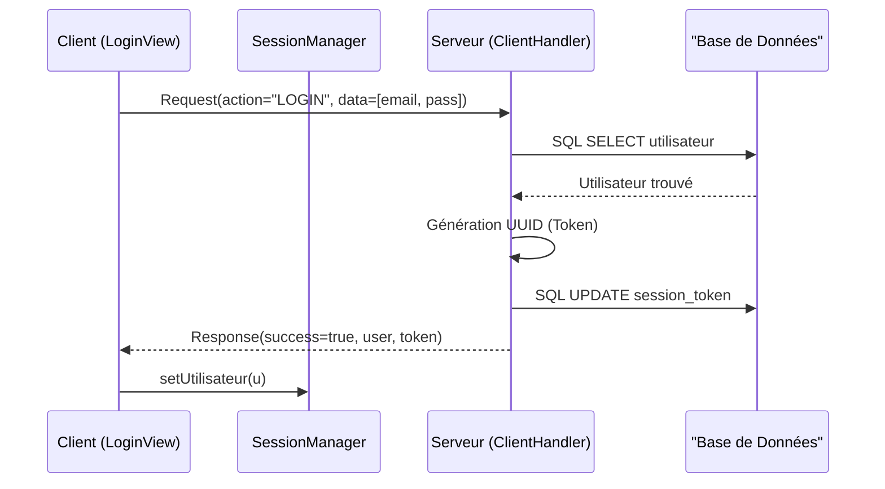
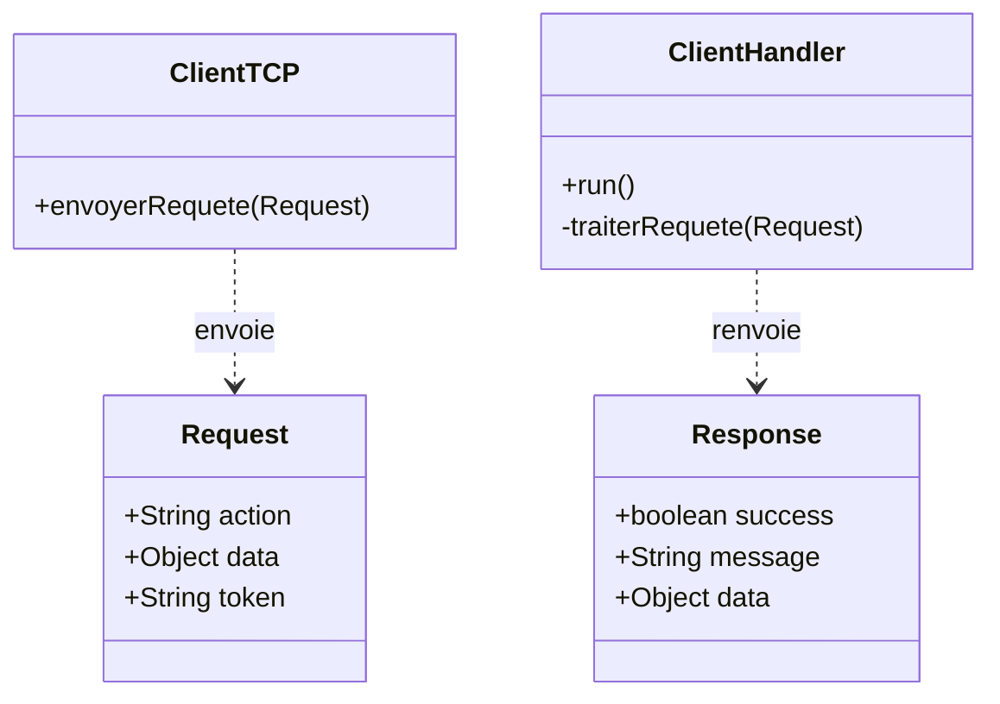

# 🏗️ Architecture et Flux de Travail (ChriOnline)

Ce document détaille le fonctionnement interne de l'application, du client jusqu'à la base de données.

## 1. Architecture Globale
L'application suit un modèle **Client/Serveur** basé sur des Sockets TCP et une architecture en couches.

### Client (JavaFX)
- **Views/Controllers** : Gèrent l'interface utilisateur et la capture d'événements.
- **Network (ClientTCP)** : Gère la connexion persistante et la sérialisation des objets.
- **SessionManager** : Gère l'utilisateur connecté et son token en mémoire vive.

### Serveur (Java)
- **Network (TCPServer & ClientHandler)** : Écoute les connexions et dédie un Thread par client.
- **Services** : Couche "Métier" qui traite les requêtes.
- **DAO (Data Access Object)** : Effectue les requêtes SQL vers MySQL.

---

## 2. Protocole de Communication
Toute communication utilise la sérialisation Java pour échanger deux types d'objets définis dans le package `common.protocol` :

1. **Request** : `[action, data, token]`
2. **Response** : `[success, message, data (objet ou liste)]`

---

## 3. Workflow : Connexion (Login)
Le processus de login est la base de la sécurité (Phase d'authentification).

### Étapes du flux :
1. **Client (LoginView)** envoie une `Request` (action="LOGIN", data=[email, password]).
2. **Serveur (ClientHandler)** intercepte la requête.
3. **Serveur** interroge la **Base de Données** (SQL SELECT).
4. **Base de Données** confirme l'existence de l'utilisateur.
5. **Serveur** génère un **UUID unique (Token)**.
6. **Serveur** met à jour le token en **Base de Données** pour cet utilisateur.
7. **Serveur** renvoie une `Response` avec succès=true, l'objet utilisateur et son token.
8. **Client** stocke ces informations dans son `SessionManager`.

---

## 4. Workflow : Consultation Sécurisée (Produits)
Toutes les actions après le login utilisent le **Token** pour prouver l'identité.

1. **Client** : Appelle `envoyerRequeteSecurisee`. Le `ClientTCP` injecte automatiquement le token du `SessionManager` dans la `Request`.
2. **Serveur (Interceptor)** : Avant de traiter l'action, le `ClientHandler` vérifie la validité du token en BDD via `UserService`.
3. **Récupération** : Le `ProductService` appelle le `ProduitDAO` -> Mapping `ResultSet` -> Conversion en `List<Produit>` -> Envoi.

---

## 5. Gestion des Stocks et Commandes (Avancé)
Le système gère l'intégrité des données lors des transactions.

- **Vérification du Stock** : Avant de valider une commande, le serveur vérifie la disponibilité en BDD (`ProduitDAO.verifierStock`).
- **Mise à jour Automatique** : Une fois le paiement validé, le stock est décrémenté automatiquement par le `ProduitDAO`.
- **Paiement Simulé** : Le processus de paiement est une simulation (dummy payment) qui retourne un succès si les informations sont syntaxiquement valides.

---

## 6. Notifications (Future Implémentation UDP)
Conformément au cahier des charges, un serveur de notification UDP est prévu :
- **Protocole** : `DatagramSocket` pour des messages rapides et sans connexion.
- **Cas d'usage** : Notification instantanée de confirmation de commande après validation TCP.

---

## 7. Flux de Navigation Locale (Détails)
Pour optimiser les performances, la navigation vers les détails ne sollicite pas le réseau.

- **Étape A** : Lors du chargement de la liste, le client reçoit tous les détails du produit.
- **Étape B** : Chaque carte graphique (`VBox`) garde une référence vers son objet `Produit`.
- **Étape C** : Au clic, l'objet est injecté dans `ProduitDetailsView`.

---

## 8. Classes et Relations Clés
### Classes Clés :
- **Request** / **Response** : Objets de transfert de données sérialisés.
- **ClientTCP** : Gère la connexion unique et sécurisée.
- **ClientHandler** : Gère le cycle de vie d'un client sur le serveur.
- **SessionManager** : Gardien de l'état de connexion côté client.

---

## 9. Gestion de la Déconnexion (Logout)
1. **Client** : Envoie `LOGOUT` au serveur.
2. **Serveur** : Invalide le token en BDD (`supprimerToken`).
3. **Client** : Efface le `SessionManager` et redirige vers la page de Login.

---

## 🎨 Diagrammes Mermaid (Source)

*Note : Cette section nécessite un éditeur supportant Mermaid pour le rendu visuel.*

### Flux de Connexion

### Structure des Classes

